![[RAG.png]]
## 🔍 What is RAG?

**RAG** = Retrieval + Generation  
It enhances LLMs by **retrieving relevant documents** and then using those as **context for generating better answers**.
### Basic Idea

> Instead of relying only on the LLM's memory, RAG fetches relevant info from external sources (like a vector DB or document store) to help generate a more accurate answer.

---

#### QA with Local Texts

Let’s say we have a few text documents like:

```
doc1.txt → "Python is a high-level programming language created by Guido van Rossum."
doc2.txt → "LangChain is a framework to build applications with LLMs using components like chains and memory."
doc3.txt → "Retrieval-Augmented Generation helps LLMs answer questions by using external data sources."
```

And  ask:

> "Who created Python?"

---

#### RAG Flow — High Level Steps

1. **Embed** the documents (convert text to vectors)
    
2. **Store** them in a Vector Store (like FAISS, Chroma, etc.)
    
3. **Embed** the user query and **search** the store
    
4. **Retrieve** top relevant docs
    
5. **Pass** them with the user question to the LLM
    
6. **Generate** final answer using both
    

#### Minimal RAG Code

```python
from langchain.embeddings import OpenAIEmbeddings
from langchain.vectorstores import FAISS
from langchain.text_splitter import CharacterTextSplitter
from langchain.llms import OpenAI
from langchain.chains import RetrievalQA
from langchain.document_loaders import TextLoader

# Load docs
loader = TextLoader("doc1.txt")
docs = loader.load()

# Split into chunks
splitter = CharacterTextSplitter(chunk_size=200, chunk_overlap=0)
split_docs = splitter.split_documents(docs)

# Embed and store in vector DB
embedding = OpenAIEmbeddings()
vectorstore = FAISS.from_documents(split_docs, embedding)

# Create retriever
retriever = vectorstore.as_retriever()

# Combine retriever + LLM
qa_chain = RetrievalQA.from_chain_type(
    llm=OpenAI(), 
    retriever=retriever
)

# Ask a question
query = "Who created Python?"
response = qa_chain.run(query)
print(response)
```

---
 ✅ Output

```
Guido van Rossum created Python.
```

---

Summary

| Step               | Description                      |
| ------------------ | -------------------------------- |
| Document Ingestion | Load and split documents         |
| Embedding          | Convert to vectors using a model |
| Storage            | Store in vector DB (e.g., FAISS) |
| Retrieval          | Find similar vectors for query   |
| Generation         | Pass to LLM with context         |
|                    |                                  |
## Multi Query 

![[RAG-2.png]]
#### Multi Query Prompt 
The **Multi-Query Prompt** is a **prompt engineering technique** used to generate **multiple alternative versions** of a user’s question to improve the diversity and depth of document retrieval in a RAG (Retrieval-Augmented Generation) system.

**Purpose**

Standard similarity-based search may miss relevant documents if the user’s query is phrased narrowly.  
By **rephrasing the original question** in multiple ways, you can retrieve a **wider and more relevant set of documents**, improving RAG performance.

---

#### 🔹 **Prompt Template**

```python
template = """You are an AI language model assistant. Your task is to generate five 
different versions of the given user question to retrieve relevant documents from a vector 
database. By generating multiple perspectives on the user question, your goal is to help
the user overcome some of the limitations of the distance-based similarity search. 
Provide these alternative questions separated by newlines. Original question: {question}"""
```

---

#### 🔹 **What It Does**

Given a question like:

```
What is task decomposition for LLM agents?
```

It might generate alternative queries like:

```
How do language model agents break tasks into subtasks?
What techniques are used for task decomposition in LLMs?
Explain the process of breaking down tasks for LLMs.
How do AI agents manage complex multi-step tasks?
What is hierarchical planning in LLM agents?
```

---

#### 🔹 **Chain It Creates**

```python
generate_queries = (
    prompt_perspectives              # 👈 multi-query prompt
    | ChatGroq(temperature=0)       # 👈 LLM to generate rewrites
    | StrOutputParser()             # 👈 parse response
    | (lambda x: x.split("\n"))     # 👈 convert to list of questions
)
```

#### 🔸 **Usage in RAG**

These generated queries are then **mapped through the retriever**, and the resulting documents are **combined (union or fusion)** to create a more complete context for the final answer generation.

#### 🌻 **Multi-Query RAG Workflow

```plaintext
                  ┌────────────────────────────┐
                  │    Original Question       │
                  │ "What is task decomposition
                  │     for LLM agents?"       │
                  └────────────┬───────────────┘
                               │
                               ▼
                  ┌────────────────────────────┐
                  │  Multi-Query Prompt Chain  │
                  │ (LLM generates 5 rephrased │
                  │   versions of the question)│
                  └────────────┬───────────────┘
                               │
              ┌─────────────────────────────────────┐
              │     List of Rephrased Questions     │
              │   ┌ Q1                              │
              │   ├ Q2                              │
              │   ├ Q3                              │
              │   ├ Q4                              │
              │   └ Q5                              │
              └────────────────┬────────────────────┘
                               │
                               ▼
              ┌────────────────────────────────┐
              │    Retriever.map()             │
              │ (Each query retrieves docs     │
              │   from vector store)           │
              └────────────┬───────────────────┘
                               │
                               ▼
              ┌────────────────────────────────┐
              │   List of Lists of Documents   │
              │ [ [D1, D2], [D3, D4], ... ]    │
              └────────────┬───────────────────┘
                               │
                               ▼
              ┌────────────────────────────────┐
              │     get_unique_union()         │
              │ (Flatten & deduplicate docs)   │
              └────────────┬───────────────────┘
                               │
                               ▼
              ┌────────────────────────────────┐
              │       Final RAG Prompt         │
              │ "Answer using this context:"   │
              └────────────┬───────────────────┘
                               │
                               ▼
                         ┌────────┐
                         │  LLM   │
                         └────────┘
                               │
                               ▼
              ┌────────────────────────────────┐
              │     Final Answer Generated     │
              └────────────────────────────────┘
```

Summary Flow:

```
Original Q ➝ Multi Queries ➝ Retrieve ➝ Dedup ➝ Final Prompt ➝ LLM ➝ Answer
```

#### When To Use Multi-Query

| Scenario                            | Why It Helps                              |
| ----------------------------------- | ----------------------------------------- |
| Your retriever misses key documents | Query diversity retrieves a broader set   |
| Questions are ambiguous             | Different rewrites clarify intent         |
| Domain terms vary                   | Captures synonyms and rewordings          |
| Enhancing recall in vector search   | Reduces dependency on single phrasing     |
| Feeding input to RRF fusion later   | More quality inputs = better final fusion |
|                                     |                                           |


### Multi Query : Retreval

#### 1. **User asks a query**

```text
"What is task decomposition in LLM agents?"
```

---

#### 2. **Generate multiple paraphrased queries**

This is done using an LLM (like `ChatGroq`, OpenAI, Claude, etc.) via a _multi-query prompt_.

```text
- How do LLMs break tasks into subtasks?
- What is hierarchical task planning in agents?
- How is task decomposition handled in LangGraph?
- What is multi-step reasoning in autonomous LLM agents?
```

---

#### 3. **Embed each query separately**

Each rewritten query is passed through the **embedding model** (e.g., `OpenAIEmbeddings`, `HuggingFaceEmbeddings`, `Instructor`, etc.)

```python
embedding_vector_1 = embed("How do LLMs break tasks into subtasks?")
embedding_vector_2 = embed("What is hierarchical task planning in agents?")
...
```

---

#### 4. **Run each embedded query against the vector store**

These embeddings are then used to **retrieve documents** independently from the vector store (e.g., FAISS, Qdrant, Chroma, Weaviate).

```python
retrieved_docs_1 = vectorstore.similarity_search(embedding_vector_1)
retrieved_docs_2 = vectorstore.similarity_search(embedding_vector_2)
...
```

---

#### 5. **Merge the results** (fusion strategy)

Now you combine results across all queries.

Two common strategies:

- **Union** (default): merge all retrieved docs, remove duplicates.
    
- **Reciprocal Rank Fusion (RRF)**: score docs from multiple queries and rank accordingly.
    

```python
final_docs = merge_results([retrieved_docs_1, ..., retrieved_docs_N])
```

---

#### 6. **Pass final docs to LLM for generation**

These merged docs are passed to the language model as **context**.

```python
llm.invoke({"context": final_docs, "question": original_question})
```

 Visualization


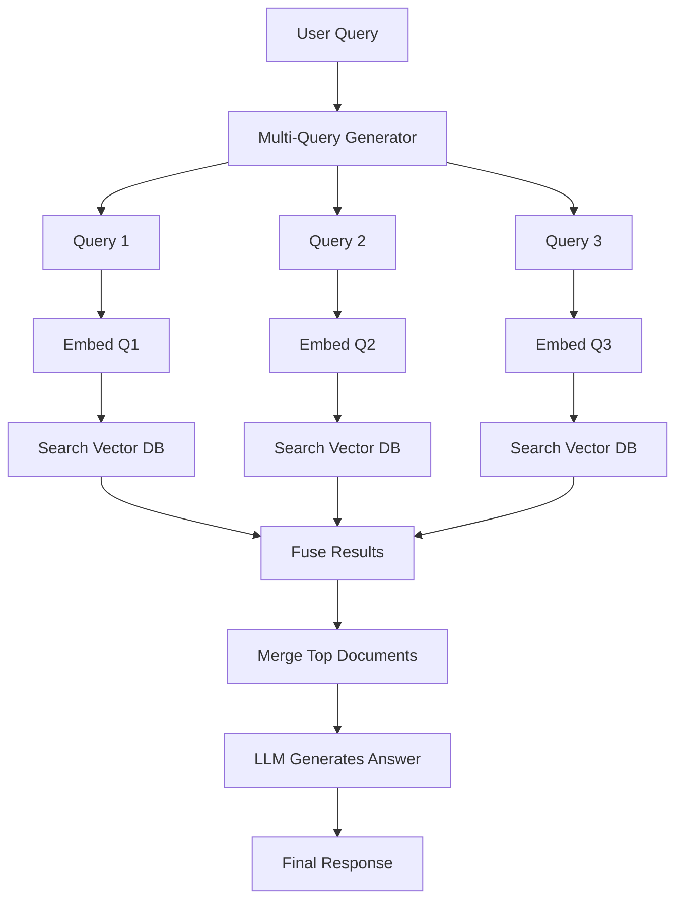


####  Summary

| Step                   | What Happens                                  |
| ---------------------- | --------------------------------------------- |
| User Query             | User gives one question                       |
| Multi-Query Generation | LLM rewrites the query in multiple forms      |
| Embedding              | Each form is embedded separately              |
| Retrieval              | Each embedded query searches the vector store |
| Fusion                 | Results from all queries are merged           |
| Generation             | Merged documents sent to LLM to answer        |
|                        |                                               |

### Example : LangChain Multi-Query Retriever — Full Pipeline Example

**LangChain pipeline** :

1. Multi-query prompt
    
2. Embedded retrieval (via `FAISS`)
    
3. Document fusion
    
4. LLM answer
    

---

#### Step-by-step Code

```python
from langchain_community.vectorstores import FAISS
from langchain_openai import OpenAIEmbeddings, ChatOpenAI
from langchain_community.document_loaders import TextLoader
from langchain.retrievers.multi_query import MultiQueryRetriever
from langchain.chains import RetrievalQA

# 1. Load and embed documents
loader = TextLoader("docs.txt")  # Your knowledge base
docs = loader.load()

embeddings = OpenAIEmbeddings()
vectorstore = FAISS.from_documents(docs, embeddings)

# 2. Create Multi-Query Retriever using LLM
llm = ChatOpenAI(model="gpt-3.5-turbo", temperature=0)
retriever = MultiQueryRetriever.from_llm(retriever=vectorstore.as_retriever(), llm=llm)

# 3. Create QA Chain
qa_chain = RetrievalQA.from_chain_type(llm=llm, retriever=retriever)

# 4. Ask a question
query = "What is task decomposition in LLM agents?"
result = qa_chain.run(query)

print("\n🔍 Final Answer:\n", result)
```

#### 📦 What this does internally:

- LLM generates multiple variations of the query.
    
- Each is embedded and retrieves docs.
    
- LangChain fuses all results into a final context.
    
- Final context passed to the LLM for the answer.
    

####  Part 2: How Reciprocal Rank Fusion (RRF) Works

When you retrieve documents for multiple queries, RRF helps score & rank them **fairly** across multiple lists.

####  How RRF scores documents:

For a document `d` across multiple ranked lists:

RRF(d)=∑i=1n1k+ranki(d)\text{RRF}(d) = \sum_{i=1}^{n} \frac{1}{k + \text{rank}_i(d)}

- `rank_i(d)` is the rank of document `d` in the i-th list.
    
- `k` is a constant (commonly 60) to smooth scores.
    

---
#### 👀 Visualization of RRF

```text
Query 1       Query 2       Query 3
--------      --------      --------
docA (1st)    docC (1st)    docA (10th)
docB (2nd)    docB (2nd)    docD (3rd)

➡ RRF score combines their ranks:
   docA = 1/61 + 1/70 = higher score
   docB = 1/62 + 1/62 = high score
```


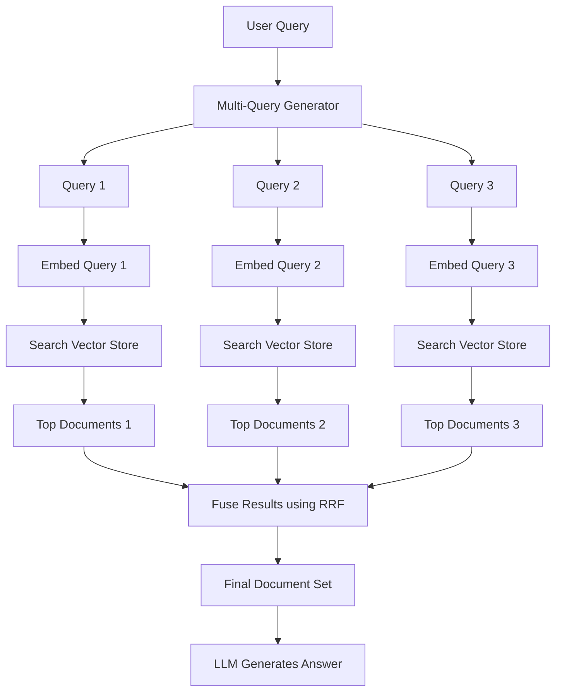

##### RRF Ranking 
**RRF** is a ranking fusion technique used to combine the results of multiple ranked lists (e.g., from different queries). It gives higher weight to documents that appear **earlier in any list**, regardless of which list.

**Formula:**

``` math
RRF Score=∑i=1n1k+ranki\text{RRF Score} = \sum_{i=1}^{n} \frac{1}{k + \text{rank}_i}RRF Score=i=1∑n​k+ranki​1
```
​

- `rank_i`: the rank of the document in the i-th list
    
- `k`: a constant (typically 60) to dampen the effect of low ranks
    
- Documents not present in a list are ignored for that list.
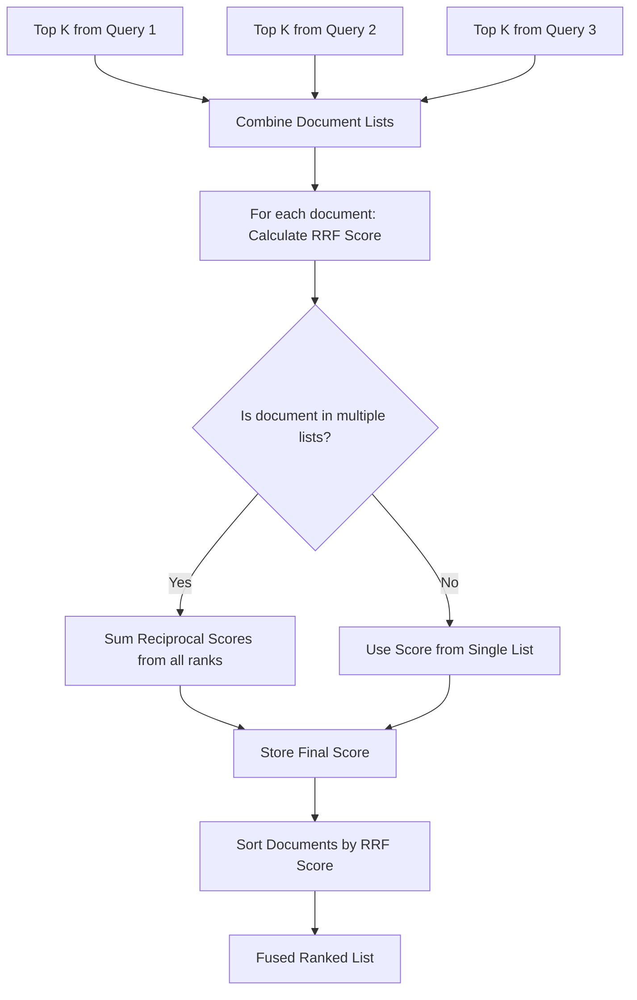
![[RAG-3.png]]


### Example 2 : 

####  Components Involved:

1. **LLM** – To generate multiple reformulations of the input query.
    
2. **MultiQueryRetriever** – To create and run sub-queries.
    
3. **Vector Store** – To search for documents based on query embeddings.
    
4. **Retriever** – To fetch relevant documents from vector store.
    
5. **RRF (Reciprocal Rank Fusion)** – To merge ranked document results.
    
6. **QA Chain** – To synthesize a final answer using LLM.
    

---

####  LangChain Code (Python)

```python
from langchain.chains import RetrievalQA
from langchain.chat_models import ChatOpenAI
from langchain.retrievers.multi_query import MultiQueryRetriever
from langchain.vectorstores import FAISS
from langchain.embeddings import OpenAIEmbeddings
from langchain.document_loaders import TextLoader
from langchain.text_splitter import RecursiveCharacterTextSplitter

# 1. Load and split your documents
loader = TextLoader("your_docs.txt")
docs = loader.load()
splitter = RecursiveCharacterTextSplitter(chunk_size=500, chunk_overlap=50)
documents = splitter.split_documents(docs)

# 2. Create vector store
embedding = OpenAIEmbeddings()
vectorstore = FAISS.from_documents(documents, embedding)

# 3. Use LLM to generate multiple queries from input
llm = ChatOpenAI(temperature=0)
retriever = MultiQueryRetriever.from_llm(
    retriever=vectorstore.as_retriever(),
    llm=llm
)

# 4. Create QA Chain using the multi-query retriever
qa_chain = RetrievalQA.from_chain_type(
    llm=llm,
    retriever=retriever,
    return_source_documents=True
)

# 5. Ask a question
query = "What are the benefits of task decomposition in AI agents?"
result = qa_chain(query)

print("Answer:", result['result'])
print("\nSources:")
for doc in result['source_documents']:
    print(doc.metadata)
```

---

#### What happens internally?

Each user query gets:

- Rephrased into **3–5 variants**
    
- All variants are embedded and searched in the **same vector store**
    
- Results from each query are merged using **Reciprocal Rank Fusion (RRF)**
    
- Final set of documents is passed to the LLM to **generate an answer**
    

####  Mermaid Diagram

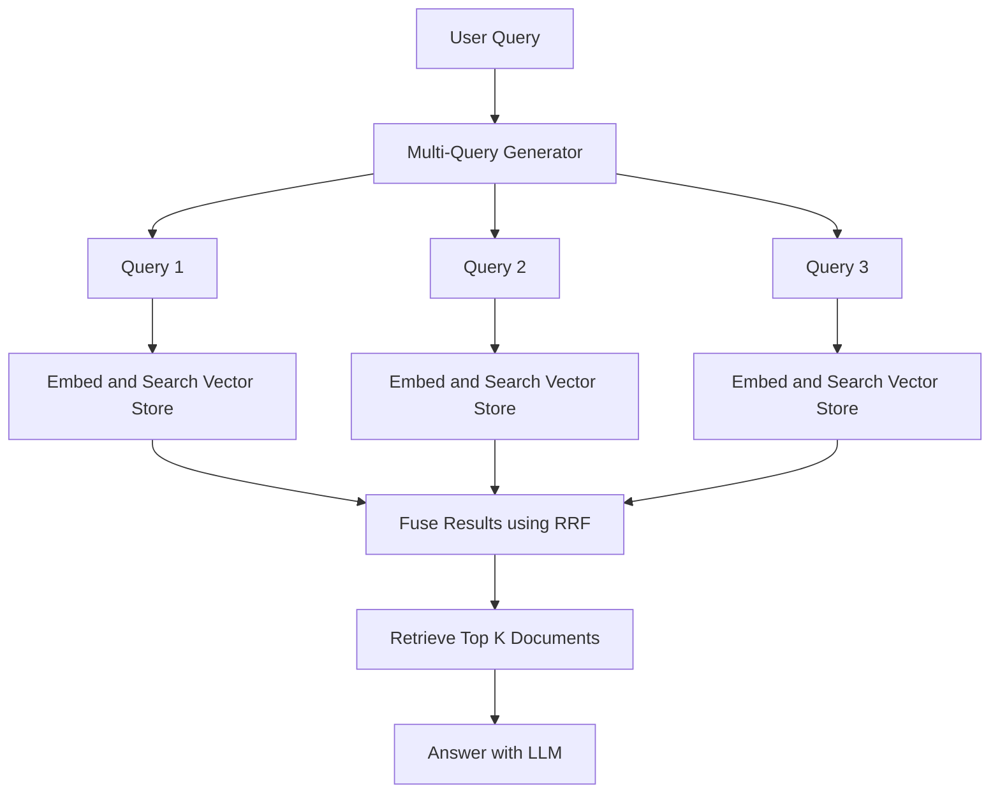

---

### 💡 Real Use Case Example:

> _“What is RAG, and how does it improve LLM responses?”_

The system will:

- Rephrase to:
    
    - "How does retrieval-augmented generation work?"
        
    - "Benefits of RAG for LLMs?"
        
    - "How do LLMs use external knowledge efficiently?"
        
- Search documents with each version
    
- Combine results
    
- Answer with best knowledge coverage
    
#### Breakdown of Steps:

1. **User Query**: The original question is asked.
    
2. **Multi-Query Generator**: A language model generates multiple reformulations.
    
3. **Query Expansion**: Queries like Query 1, 2, 3 are created.
    
4. **Embed and Search**: Each query is embedded and searched individually.
    
5. **RRF Fusion**: The results are fused using RRF to rank across all query results.
    
6. **Top-K Retrieval**: The top documents are picked after fusion.
    
7. **LLM Answering**: The selected documents are passed to an LLM for answering


## **Advanced Retrieval Techniques**

|Technique|What & Why|
|---|---|
|**Max Marginal Relevance (MMR)**|Mix diversity & relevance in document selection|
|**Hybrid Search**|Combine lexical (e.g. BM25) + vector search|
|**Metadata Filtering**|Retrieve by tags, authors, time, categories|
|**Reranking**|Use LLM or cross-encoders to re-order results|
|**Document Scoring & Weighting**|Rank based on section importance or citation freq|
Great! Here's a clear breakdown of **Advanced Retrieval Techniques** with concise explanations of what they are, why they matter, and **where** in the pipeline they typically fit:


|Technique|What it is & Why it's used|Where in Pipeline|
|---|---|---|
|**Max Marginal Relevance (MMR)**|Selects documents that are **both relevant and diverse** to reduce redundancy and improve coverage.|During **Top-K document selection** (after vector similarity search)|
|**Hybrid Search**|Combines **lexical search** (like BM25) with **vector search** to leverage exact keyword matches + semantic similarity.|At the **Retrieval** step (parallel or merged scoring)|
|**Metadata Filtering**|Filters documents based on **attributes** (e.g., author, timestamp, topic). Increases precision by using structured metadata.|Before or during **document retrieval** from vector/keyword stores|
|**Reranking**|Uses LLMs or **cross-encoders** to rerank documents based on deeper semantic understanding. Often improves relevance significantly.|After initial retrieval, before final Top-K docs are selected|
|**Document Scoring & Weighting**|Applies weights to sections or whole docs based on **importance**, e.g., titles > body, or more-cited docs > less-cited ones.|During or after **retrieval**, before or during reranking|

---


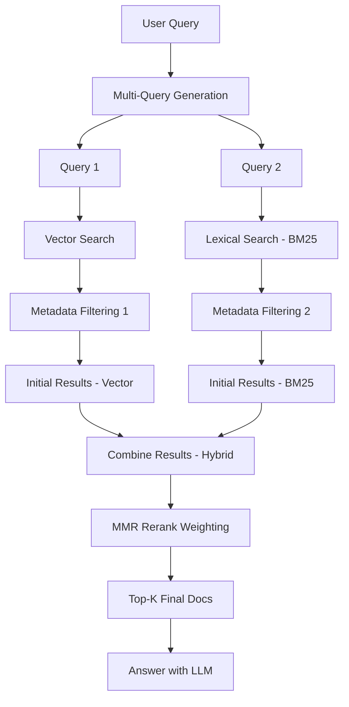

---

### 💡 Learning Focus Areas

If you're deepening your RAG pipeline understanding, here's where to dig deeper:

1. **MMR Algorithm** – Explore its math (cosine sim - λ * redundancy).
    
2. **Hybrid Retrieval with tools like `BM25 + FAISS`** – LangChain has wrappers.
    
3. **Filtering with Metadata in Chroma, Weaviate, Qdrant**.
    
4. **Reranking via BGE-reranker, Cohere Rerank, or LLM-based scoring**.
    
5. **Score Fusion** – Techniques like Reciprocal Rank Fusion (RRF), learned scoring.
    

###  Step 1: Basic Setup with a User Query

**Python Code:**

```python
query = "What are the benefits of quantum computing?"
```

**Mermaid Diagram:**

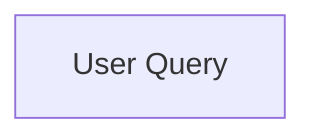

---

###  Step 2: Multi-Query Generation using LLM

```python
from langchain.llms import OpenAI
from langchain.output_parsers import StrOutputParser
from langchain.prompts import PromptTemplate
from langchain.chains import LLMChain

prompt = PromptTemplate.from_template("Generate 3 distinct search queries for: {question}")
llm = OpenAI(temperature=0)
multi_query_chain = LLMChain(llm=llm, prompt=prompt, output_parser=StrOutputParser())

queries = multi_query_chain.run(query)
queries = queries.split("\n")  # Assuming newline-separated
```


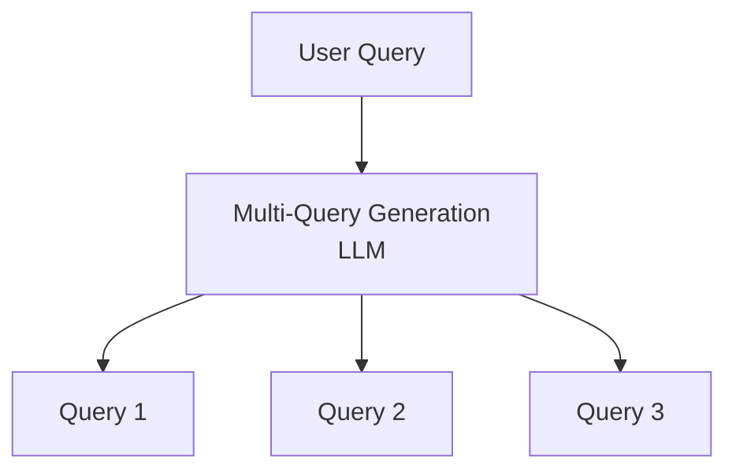

---

###  Step 3: Vector and Lexical Search (Hybrid)

```python
from langchain.vectorstores import FAISS
from langchain.embeddings import OpenAIEmbeddings
from langchain.retrievers import BM25Retriever

embedding = OpenAIEmbeddings()
vectorstore = FAISS.load_local("faiss_index", embeddings=embedding)
bm25 = BM25Retriever.from_documents(vectorstore.similarity_search(query))

vector_results = [vectorstore.similarity_search(q) for q in queries]
bm25_results = [bm25.get_relevant_documents(q) for q in queries]
```

**Mermaid Diagram:**

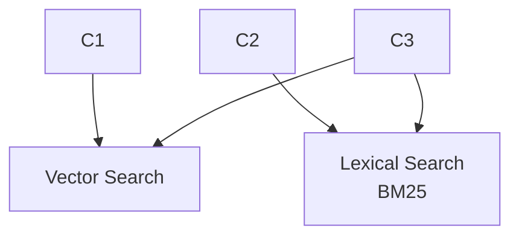

---

###  Step 4: Metadata Filtering

```python
def filter_metadata(results, tag="science"):
    return [doc for doc in results if tag in doc.metadata.get("tags", [])]

filtered_vector = [filter_metadata(res) for res in vector_results]
filtered_bm25 = [filter_metadata(res) for res in bm25_results]
```

**Mermaid Diagram:**

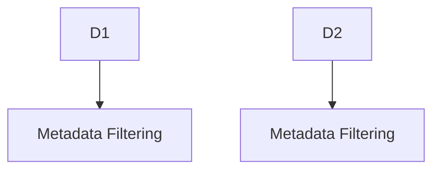


#### 🔍 What is Metadata Filtering?
Metadata is "data about data" - extra information attached to documents like:
```python
document = {
    "content": "Quantum computing uses qubits...",  # Actual content
    "metadata": {
        "author": "Alice Smith",
        "date": "2023-05-15",
        "tags": ["quantum", "physics", "emerging-tech"],
        "source": "arxiv.org"
    }
}
```

 How It Works in Your Pipeline
Your code filters for science-related content:
```python
def filter_metadata(results, tag="science"):
    return [doc for doc in results if tag in doc.metadata.get("tags", [])]
```

###### 🌟 Real-World Use Cases
1. **Date Filtering**: Only show recent docs (2023+)
   ```python
   [doc for doc in results if doc.metadata["date"] >= "2023-01-01"]
   ```
2. **Source Filtering**: Only academic papers
   ```python
   [doc for doc in results if doc.metadata["source"] in ["arxiv", "springer"]]
   ```
3. **Permission Filtering**: User-specific access
   ```python
   [doc for doc in results if "premium" not in doc.metadata.get("access", [])]
   ```

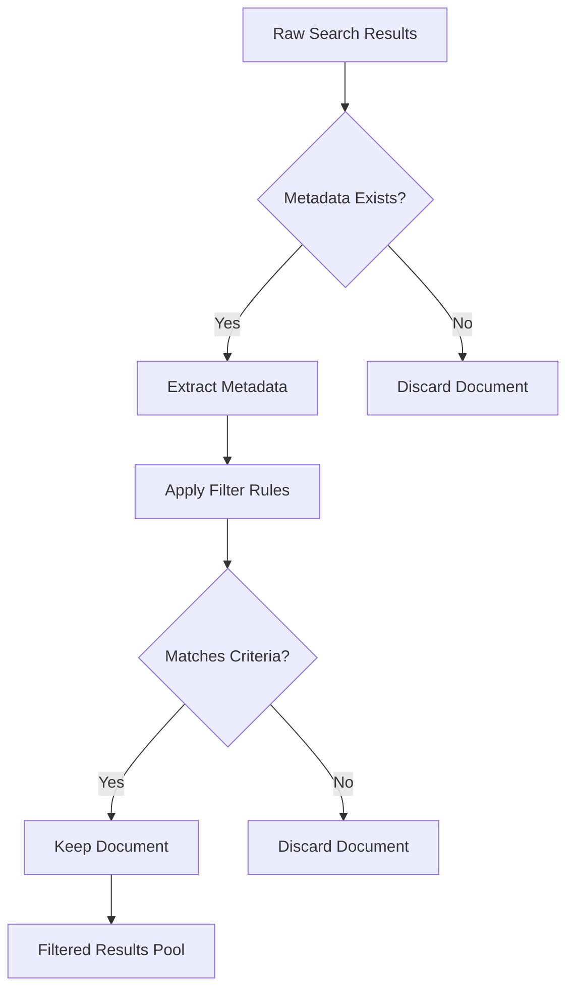
 📊 Why It Matters
- **Precision**: Removes irrelevant docs before final ranking
- **Security**: Enforces access controls
- **Freshness**: Filters outdated content

Here's a high-level Mermaid diagram showing the **metadata filtering pipeline** with advanced techniques:

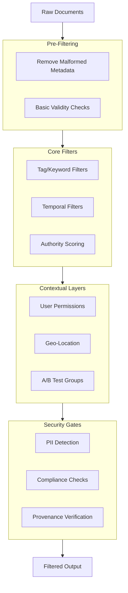

Key Flow Explanation:
1. **Pre-Filtering**: Sanitizes raw input
2. **Core Filters**: Hard requirements (tags, dates)
3. **Contextual Layers**: Dynamic business logic
4. **Security Gates**: Final compliance checks

Example : 
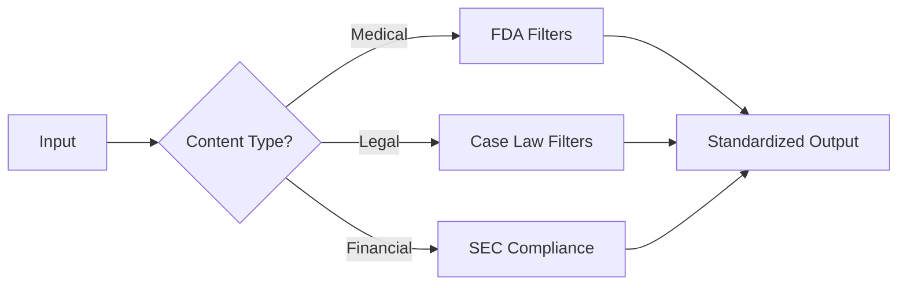

### Step 5: Combine + RRF/MMR/Reranking

```python
from langchain.retrievers.multi_query import ReciprocalRankFusion

combined = []
for v, b in zip(filtered_vector, filtered_bm25):
    combined.append(ReciprocalRankFusion().combine_documents([v, b]))
```

**Mermaid Diagram:**

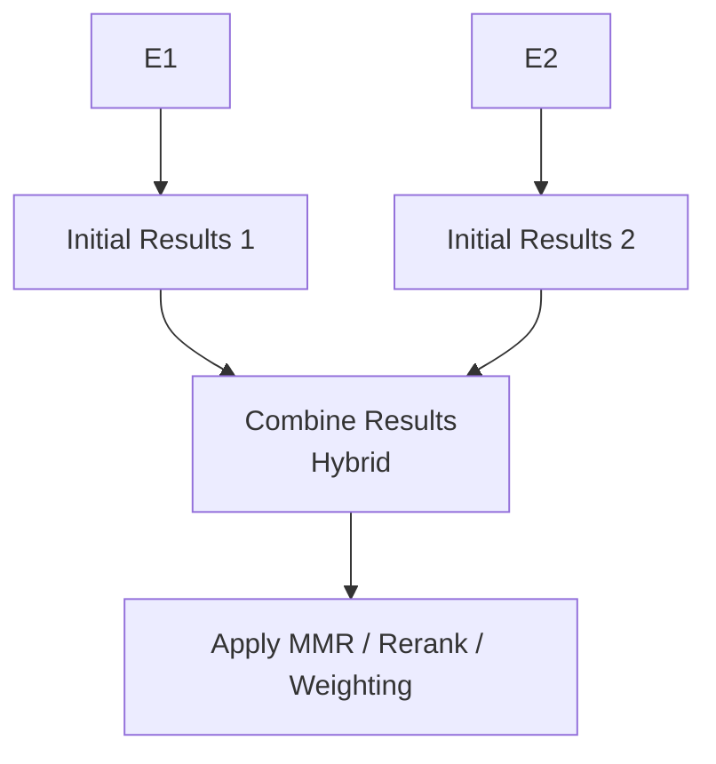

---

### Step 6: Return Final Top-K Answer

```python
top_docs = combined[0][:5]  # Top-K
for doc in top_docs:
    print(doc.page_content)
```

**Mermaid Diagram:**

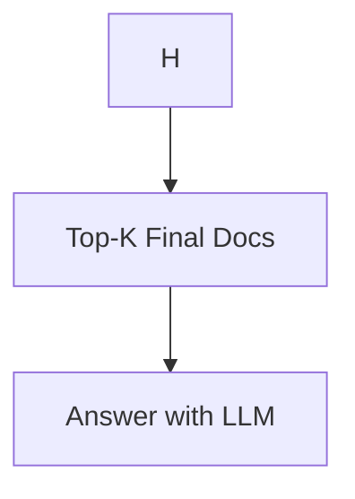

---

#### 🔄 Full Mermaid Diagram

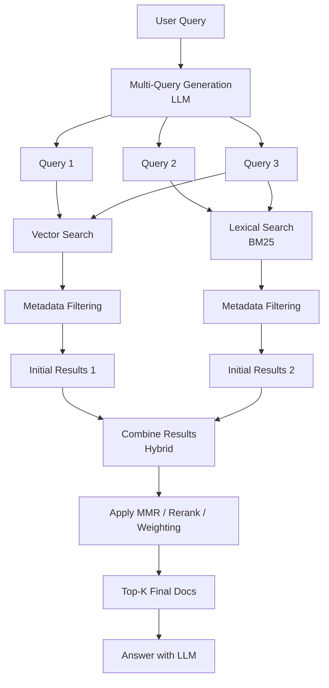

## Routing 
![[RAG-4.png]]

### **Routing in RAG: Plain English Explanation**  
**What it is:**  
A smart decision layer that directs incoming queries to the best retrieval/generation path, like a "switchboard operator" for AI systems.

---

### **How It Works (3 Key Steps)**  
1. **Query Analysis**  
   - Checks: *Question type* (factual, complex), *domain* (medical, legal), *user context* (role, permissions)  
2. **Path Selection**  
   - Chooses between:  
     - *Simple lookups* (FAQs)  
     - *Vector search* (semantic matches)  
     - *Hybrid search* (mix of keywords + vectors)  
     - *Multi-step retrieval* (for complex queries)  
3. **Execution**  
   - Sends query + retrieved docs to the LLM for answer generation  

---

### **Why It Matters**  
- **Speed:** Avoids searching irrelevant data  
- **Accuracy:** Matches questions to the right knowledge  
- **Cost Control:** Prevents overusing expensive LLMs for simple tasks  

---

### **Real-World Analogies**  
1. **Hospital Triage**  
   - Routes patients to ER, GP, or specialists based on symptoms  
2. **Air Traffic Control**  
   - Directs planes to different runways by size/destination  

---

### Routing 

## ⚙️ What is Routing?

Routing is a control flow technique where you dynamically **select a path** (chain, tool, or agent) depending on input, metadata, or classification.

**Use cases:**

- Choosing between summarization, question-answering, or translation.
    
- Routing based on language, tone, topic, or format.
    

---

## 🧠 How It Works

At a high level:

1. **Input Classifier / Router** receives input.
    
2. It selects the correct **destination chain**.
    
3. Executes that chain and returns output.
    

---

## 🧱 Components of Routing

|Component|Description|
|---|---|
|Router Chain|LLM or rule-based logic to choose a route|
|Destination Chains|Actual chains that do the task (e.g., Q&A, summarization)|
|Default Chain|Optional fallback if no match or uncertain routing|

---

## 🐍 Python Code Example (LangChain Routing)

```python
from langchain.chains.router import MultiPromptChain
from langchain.prompts import PromptTemplate
from langchain.chains import LLMChain
from langchain.llms import OpenAI

# Define your tasks
task_prompts = {
    "summarization": PromptTemplate.from_template("Summarize:\n{input}"),
    "question": PromptTemplate.from_template("Answer the question:\n{input}"),
}

# Create destination chains
llm = OpenAI(temperature=0)
destination_chains = {
    name: LLMChain(llm=llm, prompt=prompt)
    for name, prompt in task_prompts.items()
}

# Router chain prompt
router_prompt = PromptTemplate.from_template(
    "Decide if this input is a 'summarization' or a 'question':\n{input}"
)

# Router chain
router_chain = LLMChain(llm=llm, prompt=router_prompt)

# MultiPromptChain = Routing logic
routing_chain = MultiPromptChain(
    router_chain=router_chain,
    destination_chains=destination_chains,
    default_chain=destination_chains["question"]
)

# Try it out
input_data = {"input": "What is LangChain and how does it help with LLMs?"}
output = routing_chain.run(input_data)
print(output)
```

---

## 🗺 Mermaid Diagram (Incremental)

### 1. Basic Flow

```mermaid
flowchart TD
    A[User Input] --> B[Router Chain (LLM)]
```

### 2. Routing to Tasks

```mermaid
flowchart TD
    A[User Input] --> B[Router Chain (LLM)]
    B --> C1[Summarization Chain]
    B --> C2[Q&A Chain]
```

### 3. Full Pipeline

```mermaid
flowchart TD
    A[User Input] --> B[Router Chain (LLM)]
    B --> C1[Summarization Chain]
    B --> C2[Q&A Chain]
    C1 --> D[Output]
    C2 --> D
```

---

Want to try a more complex router? We can explore:

- **ToolRouterChain**
    
- **StructuredRouterChain**
    
- **Custom rules with logic expressions**
    

Let me know how deep you'd like to go into routing!